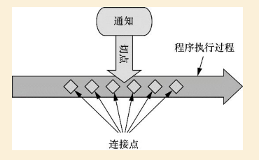

# 初识 Spring AOP

面向切面编程, 本质上位**关注点分离**.

如果要重用通用功能的话，最常见的面向对象技术是**继承(inheritance)或委托(delegation)**.

但是如果在整个应用中都使用相同的基类, 继承往往会导致一个脆弱的对象体系；
而使用委托可能需要对委托对象进行复杂的调用。

切面提供了取代继承和委托的另一种可选方案，而且在很多场景下更清晰简洁。

## AOP 基础

AOP的3个要素:

  - 通知Advice, 定义了切面要执行的**内容和时间**; Spring定义了5种通知
  - 连接点(Join Point),  定义了在**何处**可以插入切面
  - 切点PointCut, 用于定义连接点, 查找指定的连接点来执行通知

切面=切点+通知, 一般有两种作用:

- 引入(introduction), 向现有的类**增加**方法和属性
- 织入(weaving), 把切面应用到目标对象并**创建代理对象**的过程.
可供织入的生命周期有
  - 编译期, 例如lombok, AspectJ的织入编译器
  - 类加载期, 例如AspectJ 5的LTW
  - 运行期, Spring AOP就是在这个阶段织入

## Spring AOP

Spring AOP是基于**动态代理**的基础之上, 所以只局限于**方法拦截**.

切点表达式中只有**execution**指示器是执行匹配用的,
其他的指示器都是用来做更细粒度的筛选.

切点表达式, 参考:

- [Join Point Matching based on Annotations](https://www.eclipse.org/aspectj/doc/next/adk15notebook/annotations-pointcuts-and-advice.html)
- [Spring AOP](https://docs.spring.io/spring/docs/2.5.x/reference/aop.html)

### 添加新功能

TODO

## Reference

- [AspectJ](https://www.eclipse.org/aspectj/index.php)
- [Spring 实战](https://book.douban.com/subject/26767354/)